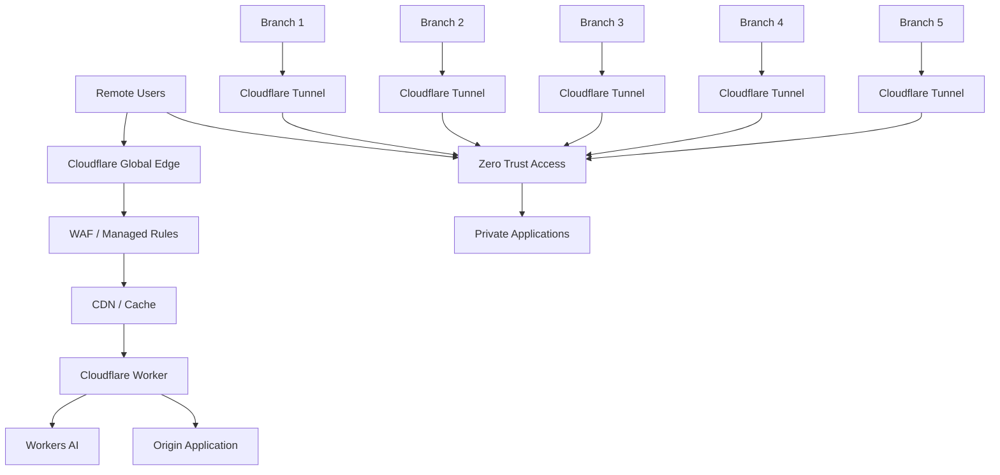

# Cloudflare Enterprise Security + Workers AI

Production-style Infrastructure-as-Code portfolio project demonstrating Cloudflare Zero Trust, CDN, WAF, DNS, Tunnel, Workers and Workers AI with Terraform.

## Architecture

The lab models **5 enterprise branches + remote users**. Branch connectivity is represented with Cloudflare Tunnel/Zero Trust patterns rather than traditional inbound VPN exposure.



## Components

- Terraform-managed Cloudflare zone/DNS
- CDN and cache configuration
- WAF custom security rules
- Cloudflare Zero Trust Access policy
- Cloudflare Tunnel examples for five branches
- Cloudflare Worker API
- Workers AI inference binding
- Security-analysis endpoint using Workers AI
- CI validation workflow
- HLD/LLD and operational documentation

## Repository structure

```text
.
├── terraform/
│   ├── main.tf
│   ├── variables.tf
│   ├── outputs.tf
│   ├── versions.tf
│   └── terraform.tfvars.example
├── worker/
│   ├── src/index.js
│   ├── wrangler.toml
│   └── package.json
├── docs/
│   ├── architecture.md
│   ├── security-model.md
│   └── deployment.md
├── diagrams/
│   └── architecture.mmd
├── .github/workflows/terraform.yml
├── .gitignore
└── SECURITY.md
```

## Deployment model

Terraform is responsible for Cloudflare infrastructure configuration. The Worker is deployed using Wrangler because Workers AI model bindings are defined naturally in the Worker runtime configuration.

1. Copy `terraform/terraform.tfvars.example` to `terraform.tfvars`.
2. Set `CLOUDFLARE_API_TOKEN` and `CLOUDFLARE_ACCOUNT_ID`.
3. Set your Cloudflare zone ID/domain.
4. Run `terraform init`, `terraform plan`, and `terraform apply`.
5. Install Node.js dependencies in `worker/`.
6. Configure the Worker name/account in `wrangler.toml`.
7. Run `npx wrangler deploy`.

> This repository is an interview/portfolio lab. Review provider resource availability and Cloudflare account entitlements before applying it to production.

## Worker endpoints

- `GET /health` — health check
- `GET /api/echo` — demonstrates edge API handling
- `POST /security/analyze` — sends a security event to Workers AI for classification/explanation

Example request:

```bash
curl -X POST https://<worker-domain>/security/analyze \
  -H 'content-type: application/json' \
  -d '{"event":"Repeated failed authentication from an unfamiliar device","severity":"medium"}'
```

## Interview talking points

This project demonstrates the lifecycle:

**Discover → Assess → Requirements → Design → IaC → Configure → Test → Pilot → Deploy → Validate → Document → Handover**

It can be used to discuss:
- Zero Trust versus network-level VPN access
- Branch-to-cloud connectivity
- DNS, TLS and HTTP request flow
- WAF and edge security
- Serverless edge compute
- AI inference at the edge
- Terraform state and CI/CD
- Security guardrails and least privilege
